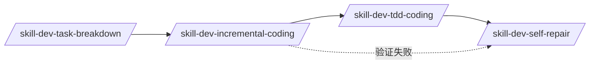

# 增量开发与分步验证

> [!CAUTION]
> **禁止一次性写完所有代码再验证！必须分阶段开发并验证。**

---

## 核心原则

```
╔═══════════════════════════════════════════════════════════════╗
║  写一点 → 测一点 → 确认一点 → 再写下一点                          ║
╚═══════════════════════════════════════════════════════════════╝
```

---

## 开发阶段

### Phase 1: 项目骨架

```yaml
files:
  - package.json
  - tsconfig.json
  - vite.config.ts / webpack.config.js
  - 其他构建配置

verify:
  - "npm install 成功 (无错误)"
  - "npm run build 成功 (无红色错误)"

block_on_fail: true
```

### Phase 2: 应用外壳

```yaml
files:
  - 主进程入口 (Electron: src/main/index.ts)
  - 渲染进程入口 (React: src/renderer/main.tsx)
  - 最小 HTML 模板

verify:
  - "npm run preview / npm run dev 能启动"
  - "看到空白窗口或最小 UI"
  - "无启动崩溃"

block_on_fail: true
```

### Phase 3: 核心组件

```yaml
files:
  - 核心 UI 组件 (TitleBar, Sidebar, etc.)
  - 状态管理 (stores/)
  - 样式文件 (globals.css)

verify:
  - "组件渲染无报错"
  - "样式正确应用"
  - "交互响应正常"

block_on_fail: false  # 可接受部分问题
```

### Phase 4: 功能实现

```yaml
files:
  - 业务逻辑
  - API 调用
  - 数据处理

verify:
  - "功能按预期工作"
  - "边界情况处理正确"

block_on_fail: true
```

### Phase 5: 预发布验证

```yaml
verify:
  - "npm run preview 完整功能可用"
  - "npm run build 无警告/错误"
  - "npm run dist (如适用) 打包成功"

block_on_fail: true
```

---

## 验证命令模板

```bash
# Phase 1
npm install
npm run build

# Phase 2 (Electron)
npm run preview
# 或
npx electron .

# Phase 2 (Web)
npm run dev

# Phase 5
npm run dist:win  # Windows
npm run dist:linux  # Linux
```

---

## 错误处理

```yaml
on_build_error:
  1: "分析错误消息"
  2: "定位问题文件"
  3: "修复代码"
  4: "重新验证当前阶段"
  5: "通过后才能进入下一阶段"

on_runtime_error:
  1: "查看控制台/日志"
  2: "定位错误源"
  3: "修复并热重载验证"
```

---

## 与其他技能的关系



---

## 检查清单

- [ ] Phase 1 通过 (项目骨架)
- [ ] Phase 2 通过 (应用外壳)
- [ ] Phase 3 通过 (核心组件)
- [ ] Phase 4 通过 (功能实现)
- [ ] Phase 5 通过 (预发布验证)

> [!WARNING]
> 任何一个阶段失败都必须修复后才能继续！
