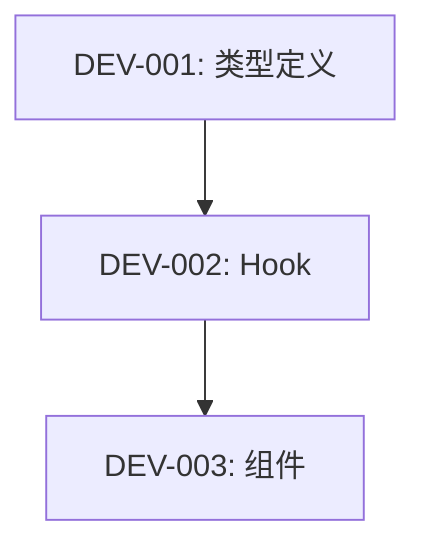

# Skill: Task Breakdown / 任务分解

将技术实施计划拆解为可独立完成的原子编码任务。

## Steps

### Step 1: Observe - 读取实施计划

```yaml
inputs:
  - implementation_plan: "架构师的实施计划"
  - api_spec: "API 规范"
```

### Step 2: Orient - 分析依赖关系

```yaml
dependency_graph:
  - task: "创建数据模型"
    depends_on: []
  - task: "实现 API 路由"
    depends_on: ["创建数据模型"]
  - task: "开发 UI 组件"
    depends_on: ["实现 API 路由"]
```

### Step 3: Decide - 生成原子任务

```yaml
atomic_tasks:
  - id: "DEV-001"
    title: "创建 User 类型定义"
    file: "src/types/user.ts"
    estimated: "15min"
    test_required: false
    
  - id: "DEV-002"
    title: "实现 useUser hook"
    file: "src/hooks/useUser.ts"
    estimated: "30min"
    test_required: true
    test_file: "src/hooks/__tests__/useUser.test.ts"
```

### Step 4: Act - 输出任务清单

```markdown
# 开发任务清单

## 依赖顺序


## 任务列表
| ID | 任务 | 文件 | 预估 | 测试 |
|----|------|------|------|------|
| DEV-001 | 创建类型 | types/user.ts | 15min | - |
| DEV-002 | 实现Hook | hooks/useUser.ts | 30min | ✅ |
```

### Step 5: Validate - 校验任务完整

- [ ] 覆盖实施计划所有步骤？
- [ ] 依赖顺序正确？
- [ ] 需要测试的任务已标记？

## Output

进入逐一执行模式，按顺序完成各原子任务。
