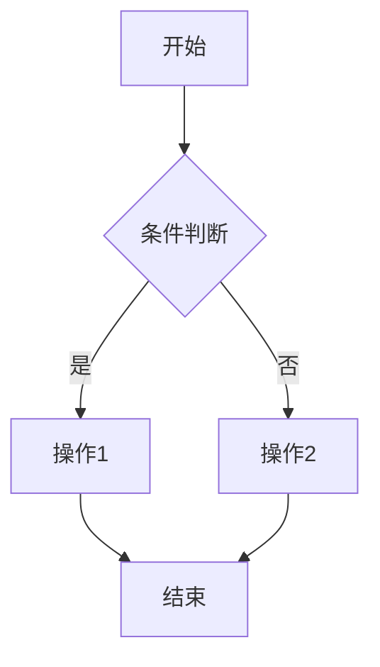

# Skill: PRD Creation / PRD 生成

生成结构化、AI-Ready 的产品需求文档。

## Steps

### Step 1: Observe - 收集需求信息

```yaml
inputs:
  - requirement_analysis: "需求分析报告"
  - task_description: "任务描述"
  - clarifications: "用户澄清内容"
```

### Step 2: Orient - 确定 PRD 结构

标准 PRD 模板：

```markdown
# PRD: [功能名称]

## 1. 背景与目标
## 2. 目标用户
## 3. 用户故事
## 4. 功能描述
## 5. 交互流程
## 6. 验收标准
## 7. 非功能性需求
## 8. 排除范围
## 9. 术语表
```

### Step 3: Decide - 填充各章节内容

#### 3.1 背景与目标

```markdown
## 1. 背景与目标

### 背景
[简述当前问题或机会]

### 目标
- 目标1：[可量化的目标]
- 目标2：[可量化的目标]

### 成功指标
- KPI 1：[具体指标]
- KPI 2：[具体指标]
```

#### 3.2 用户故事

```markdown
## 3. 用户故事

### US-001: [故事标题]
**作为** [用户角色]
**我希望** [功能描述]
**以便** [用户价值]

**验收标准**：
- Given [前提条件]
- When [用户操作]
- Then [预期结果]
```

#### 3.3 功能描述

```markdown
## 4. 功能描述

### 4.1 [功能模块1]

| 字段 | 类型 | 必填 | 说明 |
|------|------|------|------|
| name | string | 是 | 用户名称 |

**业务规则**：
- BR-001: [规则描述]
```

#### 3.4 交互流程

```markdown
## 5. 交互流程

### 5.1 主流程


```

#### 3.5 非功能性需求

```markdown
## 7. 非功能性需求

### 性能
- 响应时间：< 200ms (P95)
- 并发用户：支持 1000

### 安全
- 认证方式：JWT
- 敏感数据：加密存储

### 可用性
- SLA：99.9%
- 降级策略：[描述]
```

### Step 4: Act - 生成 PRD 文档

将各章节组合成完整文档，确保：
- 术语一致
- 格式规范
- 引用正确

### Step 5: Validate - 自检 PRD 质量

使用 `skill-pm-validate-prd` 进行五维度验证。

若验证不通过 → 回到 Step 3 修正。

## Output

生成文件：`PRD_[功能名称].md`

## PRD Template / 完整模板

```markdown
# PRD: [功能名称]

| 属性 | 值 |
|------|-----|
| 版本 | 1.0 |
| 作者 | Product Manager Agent |
| 日期 | 2026-01-02 |
| 状态 | Draft |

## 1. 背景与目标

### 1.1 背景
[问题描述]

### 1.2 目标
- [目标1]
- [目标2]

## 2. 目标用户

| 用户类型 | 特征 | 需求 |
|----------|------|------|
| 类型1 | 描述 | 需求 |

## 3. 用户故事

### US-001: [标题]
**作为** [角色]，**我希望** [功能]，**以便** [价值]。

## 4. 功能描述

### 4.1 [模块名称]
[详细描述]

## 5. 交互流程

### 5.1 主流程
[流程图]

## 6. 验收标准

- [ ] AC-001: [标准描述]
- [ ] AC-002: [标准描述]

## 7. 非功能性需求

### 7.1 性能
- [指标]

### 7.2 安全
- [要求]

## 8. 排除范围

以下内容**不在**本版本范围内：
- [排除项1]

## 9. 术语表

| 术语 | 定义 |
|------|------|
| 术语1 | 定义 |
```

---

> [!TIP]
> PRD 完成后自动触发验证流程，确保质量符合标准。
