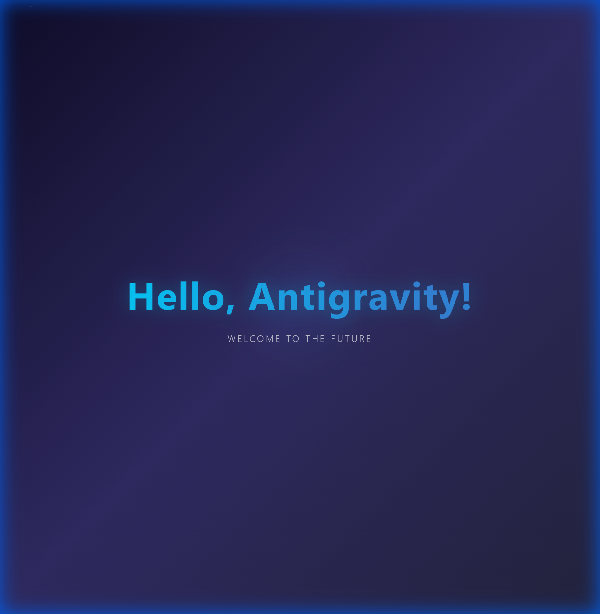
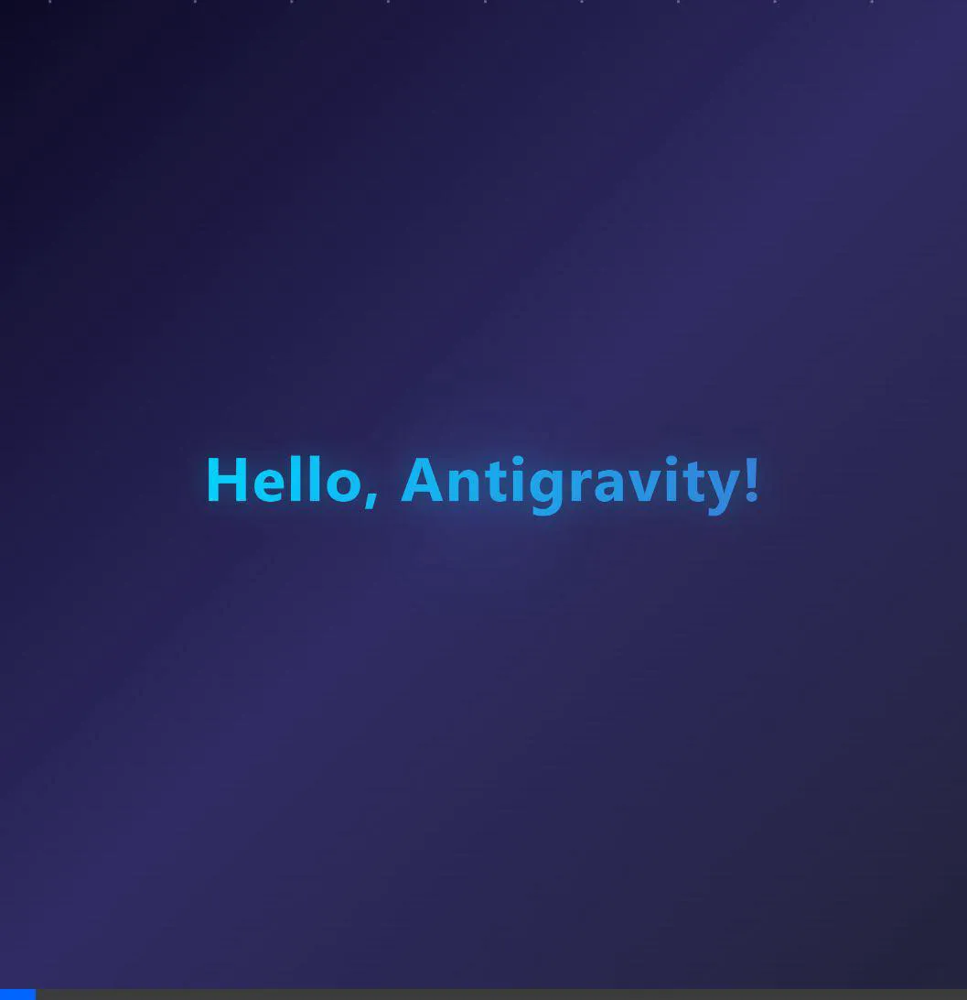

# Walkthrough: Hello World HTML Page

**Project:** Hello World  
**Date:** 2026-01-04  
**Mode:** Express (任务复杂度 < 3)

---

## Summary

成功创建了一个显示 "Hello, Antigravity!" 的 HTML 页面，采用现代 Web 设计美学。

---

## What Was Built

### [index.html](file:///e:/code/workspace/2026/0104/Antigravity-AI/.antigravity-output/hello-world-20260104/04_implementation/index.html)

一个独立的 HTML 页面，包含：

- **主标题:** "Hello, Antigravity!" - 渐变色文字，动态浮动效果
- **副标题:** "Welcome to the Future" - 淡入动画
- **背景:** 深紫色渐变，粒子动画，脉冲光效

---

## Verification

| Test | Result |
|------|--------|
| 页面加载 | ✅ 成功 |
| 文本显示 | ✅ "Hello, Antigravity!" |
| 视觉效果 | ✅ 动画、渐变、粒子 |

---

## Demo





---

## Files Delivered

```
.antigravity-output/hello-world-20260104/
├── 01_planning/Task_List.json
├── 04_implementation/index.html
├── 05_testing/
│   ├── Test_Report.md
│   ├── Walkthrough.md
│   ├── screenshot_verification.png
│   └── demo_recording.webp
├── mission.md
└── _metadata.json
```
