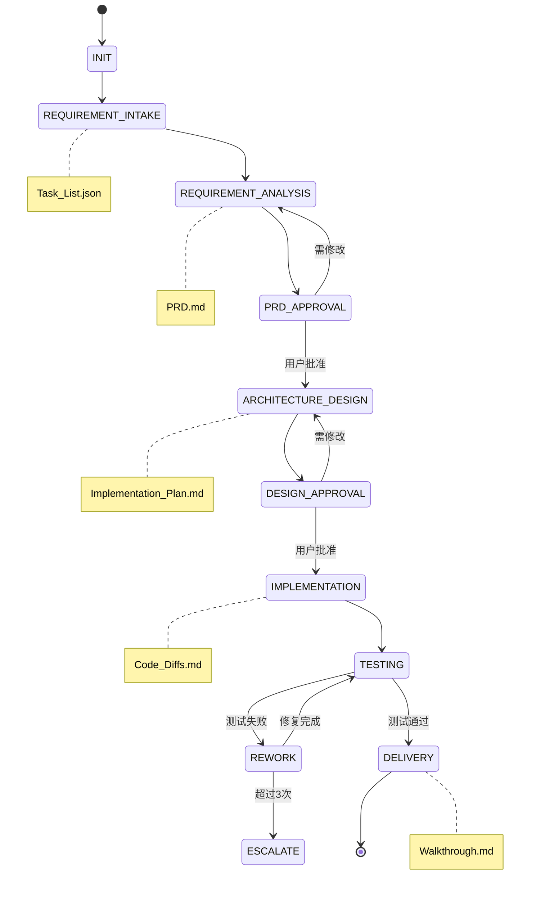

# Antigravity AI 开发团队 - 工作流架构

## 系统概览

Antigravity AI 开发团队是一个基于 **VOODA 认知循环 + SOP 状态机 + MCP 工具协议** 的智能软件开发系统。

```
┌─────────────────────────────────────────────────────────────────────┐
│                         用户需求输入                                 │
└─────────────────────────────────┬───────────────────────────────────┘
                                  ▼
┌─────────────────────────────────────────────────────────────────────┐
│                      主编排器 (antigravity-team.md)                  │
│  ┌───────────┬───────────┬───────────┬───────────┬───────────┐     │
│  │ INTAKE    │ ANALYSIS  │ DESIGN    │ IMPLEMENT │ TESTING   │     │
│  │ 需求接收   │ 需求分析   │ 架构设计  │ 代码实现  │ 测试验证   │     │
│  └─────┬─────┴─────┬─────┴─────┬─────┴─────┬─────┴─────┬─────┘     │
│        │           │           │           │           │            │
│        ▼           ▼           ▼           ▼           ▼            │
│  ┌───────────┬───────────┬───────────┬───────────┬───────────┐     │
│  │ 项目主管  │ 产品经理   │ 架构师    │ 开发工程师 │ 测试工程师│     │
│  └───────────┴───────────┴───────────┴───────────┴───────────┘     │
└─────────────────────────────────────────────────────────────────────┘
                                  ▼
┌─────────────────────────────────────────────────────────────────────┐
│                           交付物输出                                 │
│    Task_List.json → PRD.md → Implementation_Plan.md → Code → Test  │
└─────────────────────────────────────────────────────────────────────┘
```

---

## 核心模块

### 框架层 (4 个)

| 模块 | 文件 | 职责 |
|------|------|------|
| 主编排器 | `antigravity-team.md` | 调度角色、管理状态流转 |
| VOODA 循环 | `_vooda-loop.md` | 认知架构、子代理调度 |
| 执行守卫 | `_execution-guard.md` | 强制规则、制品检查 |
| MCP 工具 | `_mcp-tools.md` | 工具配置、权限管理 |

### 扩展模块 (2 个)

| 模块 | 文件 | 职责 |
|------|------|------|
| 错误恢复 | `_error-recovery.md` | 状态保存、断点续传 |
| 制品验证 | `_artifact-validator.md` | 自动验证制品格式 |

---

## 角色工作流 (5 个)

```
┌─────────────────────────────────────────────────────────────────┐
│                    PROJECT LEAD (项目主管)                       │
│                  接收需求 → 任务拆解 → 进度仲裁                    │
│               MCP: github, fabric-mcp-server                    │
└─────────────────────────┬───────────────────────────────────────┘
                          │
          ┌───────────────┼───────────────┐
          ▼               ▼               ▼
┌─────────────────┐ ┌─────────────────┐ ┌─────────────────┐
│  PRODUCT MGR    │ │   ARCHITECT     │ │   DEVELOPER     │
│   产品经理       │ │   系统架构师     │ │   开发工程师     │
│   需求→PRD      │ │   PRD→设计      │ │   设计→代码     │
│ MCP: rednote,   │ │ MCP: github,    │ │ MCP: github,    │
│ tavily, fabric  │ │ tavily, fabric  │ │     fabric      │
└────────┬────────┘ └────────┬────────┘ └────────┬────────┘
         │                   │                   │
         └───────────────────┼───────────────────┘
                             ▼
              ┌─────────────────────────────┐
              │       QA ENGINEER           │
              │        测试工程师            │
              │   代码→测试→验收/返工        │
              │   MCP: puppeteer, fabric    │
              └─────────────────────────────┘
```

| 角色 | 文件 | 输入 | 输出 |
|------|------|------|------|
| 项目主管 | `role-project-lead.md` | 用户需求 | Task_List.json |
| 产品经理 | `role-product-manager.md` | Task_List | PRD.md |
| 架构师 | `role-architect.md` | PRD | Implementation_Plan.md |
| 开发工程师 | `role-developer.md` | Plan | Code_Diffs.md |
| 测试工程师 | `role-qa-engineer.md` | Code | Test_Report.md, Walkthrough.md |

---

## 技能工作流 (16 个)

### 项目主管技能 (2)
| 技能 | 文件 | 说明 |
|------|------|------|
| 任务拆解 | `skill-lead-task-decompose.md` | 需求→任务清单 |
| 进度仲裁 | `skill-lead-progress-arbitrate.md` | 监控、协调 |

### 产品经理技能 (3)
| 技能 | 文件 | 说明 |
|------|------|------|
| 需求分析 | `skill-pm-analyze-requirement.md` | 意图解析 |
| PRD 生成 | `skill-pm-create-prd.md` | 结构化文档 |
| PRD 验证 | `skill-pm-validate-prd.md` | 五维度审查 |

### 架构师技能 (3)
| 技能 | 文件 | 说明 |
|------|------|------|
| 可行性评估 | `skill-arch-feasibility-assess.md` | 技术选型 |
| API 设计 | `skill-arch-api-design.md` | 接口定义 |
| 实施计划 | `skill-arch-implementation-plan.md` | 技术方案 |

### 开发工程师技能 (4)
| 技能 | 文件 | 说明 |
|------|------|------|
| 任务分解 | `skill-dev-task-breakdown.md` | 原子任务 |
| TDD 编码 | `skill-dev-tdd-coding.md` | 测试驱动 |
| 自我修复 | `skill-dev-self-repair.md` | 错误修复 |
| 缺陷修复 | `skill-dev-bug-fix.md` | 响应返工 |

### 测试工程师技能 (5)
| 技能 | 文件 | 说明 |
|------|------|------|
| 构建验证 | `skill-qa-build-verify.md` | 真实构建验证 |
| 测试策略 | `skill-qa-test-strategy.md` | 用例设计 |
| E2E 测试 | `skill-qa-e2e-test.md` | Puppeteer |
| 缺陷报告 | `skill-qa-defect-report.md` | 触发返工 |
| 演示演练 | `skill-qa-walkthrough.md` | 验收文档 |

---

## VOODA 认知循环

每个角色执行任务时遵循 5 阶段认知循环：

```
    ┌─────────┐
    │ OBSERVE │ ← 收集环境信息
    │  观察   │
    └────┬────┘
         ▼
    ┌─────────┐
    │ ORIENT  │ ← 分析局势
    │  定位   │
    └────┬────┘
         ▼
    ┌─────────┐
    │ DECIDE  │ ← 生成方案
    │  决策   │   (子代理共识)
    └────┬────┘
         ▼
    ┌─────────┐
    │   ACT   │ → 执行操作
    │  行动   │   (调用 MCP)
    └────┬────┘
         ▼
    ┌─────────┐     失败
    │VALIDATE │ ──────────┐
    │  校验   │           │
    └────┬────┘           │
         │ 通过           ▼
         ▼           回退至 DECIDE
      完成
```

### 子代理并行处理

```
         主代理 (综合者)
              │
    ┌─────────┼─────────┬─────────┐
    ▼         ▼         ▼         ▼
┌───────┐ ┌───────┐ ┌───────┐ ┌───────┐
│ SUB-A │ │ SUB-B │ │ SUB-C │ │ SUB-D │
│乐观者 │ │悲观者 │ │创新者 │ │语境者 │
└───────┘ └───────┘ └───────┘ └───────┘
    │         │         │         │
    └─────────┴─────────┴─────────┘
              │
         共识投票 (3/4)
```

---

## 状态流转




## 制品目录结构

```
.antigravity-output/{task_id}/
├── 01_planning/
│   └── Task_List.json         # 项目主管
├── 02_requirements/
│   ├── PRD.md                 # 产品经理
│   └── PRD_Validation_Report.md
├── 03_design/
│   ├── Implementation_Plan.md # 架构师
│   └── API_Spec.yaml
├── 04_implementation/
│   ├── Code_Diffs.md          # 开发工程师
│   └── src/
├── 05_testing/
│   ├── Test_Report.md         # 测试工程师
│   ├── Walkthrough.md
│   └── screenshots/
└── _metadata.json             # 状态记录
```

---

## 执行模式

| 模式 | 触发条件 | VOODA 阶段 | 审批门 |
|------|----------|-----------|--------|
| 严格模式 | 默认 | 全部 5 阶段 | 阻断 |
| 快速模式 | 用户说 "express" | DECIDE→ACT→VALIDATE | 建议 |

---

## 文件清单

```
.agent/workflows/
├── antigravity-team.md          # 主编排器
├── _vooda-loop.md               # VOODA 认知循环
├── _execution-guard.md          # 执行守卫
├── _mcp-tools.md                # MCP 工具配置
├── _error-recovery.md           # 错误恢复模块
├── _artifact-validator.md       # 制品验证器
├── role-project-lead.md         # 项目主管
├── role-product-manager.md      # 产品经理
├── role-architect.md            # 架构师
├── role-developer.md            # 开发工程师
├── role-qa-engineer.md          # 测试工程师
├── skill-lead-task-decompose.md
├── skill-lead-progress-arbitrate.md
├── skill-pm-analyze-requirement.md
├── skill-pm-create-prd.md
├── skill-pm-validate-prd.md
├── skill-arch-feasibility-assess.md
├── skill-arch-api-design.md
├── skill-arch-implementation-plan.md
├── skill-dev-task-breakdown.md
├── skill-dev-tdd-coding.md
├── skill-dev-self-repair.md
├── skill-dev-bug-fix.md
├── skill-qa-test-strategy.md
├── skill-qa-build-verify.md     # 真实构建验证
├── skill-qa-e2e-test.md
├── skill-qa-defect-report.md
└── skill-qa-walkthrough.md
```

**共计: 28 个工作流文件**
